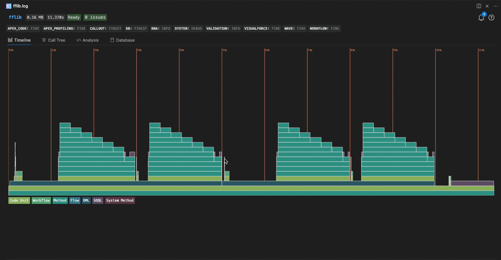
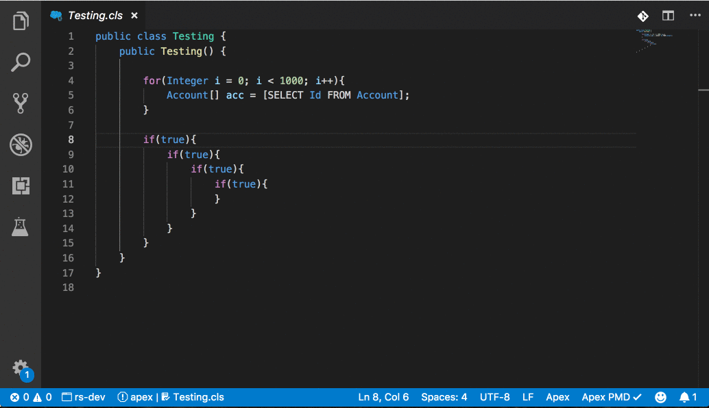
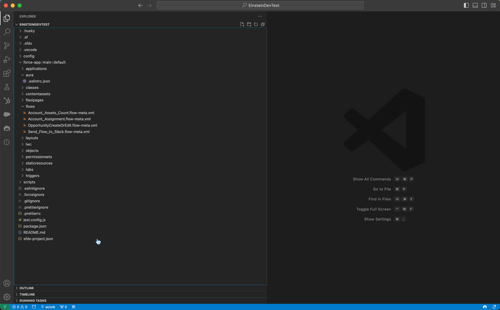
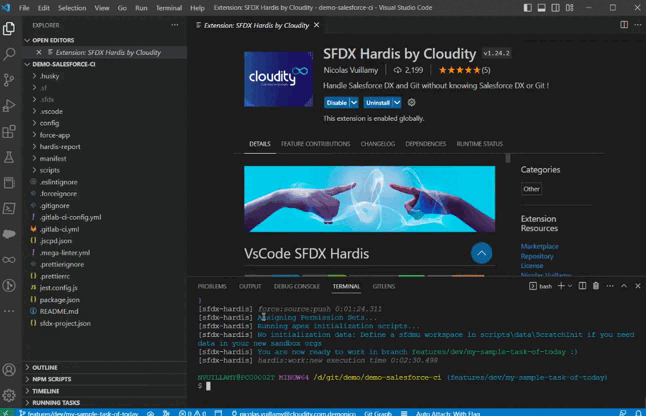

# Code Builder Extensions

    

_This curated list features (unofficial) Salesforce Code Builder Extensions. Here we hope to connect Trailblazers and build together in the Ohana Spirit! 💖_

- [Apex Log Analyzer](#apex-log-analyzer)
- [Apex PMD](#apex-pmd)
- [Lightning Flow Scanner](#lightning-flow-scanner)
- [Salesforce Flow Visualiser](#salesforce-flow-visualiser)
- [SFDX Hardis](#sfdx-hardis)

---

## Apex Log Analyzer

<a href="https://open-vsx.org/extension/FinancialForce/lana">Apex Log Analyzer</a> makes performance analysis of Salesforce much easier and quicker. Visualize code execution via a Flame chart and Call Tree, and identify and resolve performance and SOQL/DML problems via Method and Database Analysis.

<a href="#salesforce-code-builder-extensions">Back to top</a>

---

## Apex PMD

<a href="https://open-vsx.org/extension/pmd/apex-pmd">Apex PMD</a> allows you to run static analysis on Apex, VisualForce, and other XML metadata files. Highlighted features include:
- Running analysis on the entire workspace
- Running analysis on file open, save and/or change
- Define your own ruleset

<a href="#salesforce-code-builder-extensions">Back to top</a>

---

## Lightning Flow Scanner

<a href="https://open-vsx.org/extension/ForceConfigControl/lightningflowscanner">Lightning Flow Scanner</a> allows you to run static analysis on Salesforce Flows. It is designed to pinpoint deviations from industry best practices in Salesforce Flows, helping you ensure the highest standards in your business automation.

<a href="#salesforce-code-builder-extensions">Back to top</a>

---

## Salesforce Flow Visualiser

<a href="https://open-vsx.org/extension/ToddHalfpenny/sfflowvisualiser">Salesforce Flow Visualiser</a> allows you to create a visual representation of Salesforce Flow .flow-meta.xml files. It also outputs start conditions, constants, text templates, variables, and more! You can zoom in/out on the flow itself and save the image as a .png file.

<a href="#salesforce-code-builder-extensions">Back to top</a>

---

## SFDX Hardis

<a href="https://open-vsx.org/extension/NicolasVuillamy/vscode-sfdx-hardis">SFDX Hardis</a> by Cloudity aims to simplify the use of Salesforce DX with an intuitive UI, assisting users with interactive wizards and preconfigured sets of commands.

<a href="#salesforce-code-builder-extensions">Back to top</a>
